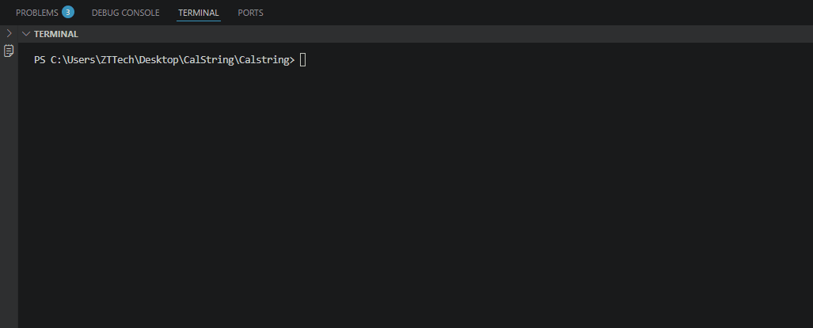

# CalString - Satrli Ifodalarni Hisoblovchi Dastur

## 📌 Loyiha haqida
**CalString** — bu foydalanuvchi tomonidan kiritilgan matematik ifodalarni (masalan: `1+5-2+10`) matn ko'rinishida qabul qilib, ularning natijasini hisoblab beruvchi konsol ilovasi. 

Ushbu loyiha dasturlash asoslarini, xususan, satrlar (strings) bilan ishlash va mantiqiy algoritmlarni o'rganish maqsadida yaratilgan.

## 🛠 Vazifasi
Dasturning asosiy vazifasi — murakkab ko'ringan satrli ifodani bo'laklarga bo'lib, undagi sonlarni va amallarni (+, -) ajratib olish va yakuniy natijani chiqarishdir.

## Ishlash jarayoni

## 💻 Foydalanilgan dasturlar va texnologiyalar
Loyihani ishlab chiqishda quyidagi vositalardan foydalanildi:

1.  **C# (C-Sharp):** Dasturiy kodni yozish uchun asosiy til.
2.  **.NET SDK:** Kodni kompilyatsiya qilish va ishga tushirish uchun platforma.
3.  **Visual Studio Code:** Kod yozish uchun asosiy muharrir (IDE).
4.  **Git & GitHub:** Versiya nazorati va loyihani bulutli saqlash uchun.
5.  **ScreenToGif:** Dasturning ishlash jarayonini yozib olish va vizual ko'rinishda namoyish etish uchun.

## 🚀 Qanday ishlatiladi?
1. Dasturni ishga tushirasiz.
2. Konsolga ixtiyoriy matematik ifodani kiritasiz (masalan: `10+20-5`).
3. Dastur ifodani tahlil qilib, `Natija: 25` degan javobni qaytaradi.